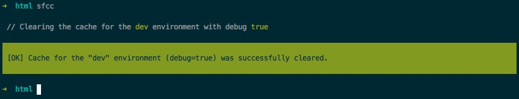

```asciidoc
██████╗  ██████╗  ██████╗██╗  ██╗███████╗██████╗       ███████╗███████╗██████╗ 
██╔══██╗██╔═══██╗██╔════╝██║ ██╔╝██╔════╝██╔══██╗      ██╔════╝██╔════╝╚════██╗
██║  ██║██║   ██║██║     █████╔╝ █████╗  ██████╔╝█████╗███████╗█████╗   █████╔╝
██║  ██║██║   ██║██║     ██╔═██╗ ██╔══╝  ██╔══██╗╚════╝╚════██║██╔══╝   ╚═══██╗
██████╔╝╚██████╔╝╚██████╗██║  ██╗███████╗██║  ██║      ███████║██║     ██████╔╝
╚═════╝  ╚═════╝  ╚═════╝╚═╝  ╚═╝╚══════╝╚═╝  ╚═╝      ╚══════╝╚═╝     ╚═════╝ 
                                                                               
```

## docker-sf3 - advanced LAMP setup for symfony3 development
[](https://travis-ci.org/nerdpress-org/docker-sf3)

permission-hassle free <sup>:tm:</sup> [» More](/Resources/doc/permissions.md)

## Installation

    git clone https://github.com/nerdpress-org/docker-sf3.git docker-sf3
    cp -r docker-sf3/docker /path/to/your/symfony-project/

## Please Notice

This software compilation is ment for local development purpose only.

## Usage

    cd /path/to/your/symfony-project/docker
    ./docker.sh -l
    
This will build and start all containers and log you into the symfony container as _www-data_.  
[» More startup options ](Resources/doc/startup.md)



Open the browser: [http://[docker-host]:8080](http://[docker-host]:8080) 

   


## Development Webserver (sf_web) 

_PHP7 on Apache 2.4 (http2 enabled)_
from the [Ondřej Surý PPA](https://launchpad.net/~ondrej)
running on [Ubuntu:Xenial](https://hub.docker.com/_/ubuntu/) Docker Image.

### Debugging

Xdebug and Blackfire.io support are included by default.   
[» How to configure](Resources/doc/debug.md) 

### zsh default shell
[oh-my-zsh](https://github.com/robbyrussell/oh-my-zsh) is the default shell.

The Dockerfile can be found here:
(/docker/sf_web Docker

## DB (sf_db)
Official [MySQL:5](https://hub.docker.com/r/mysql/mysql-server/) Docker is used.  
Use the name of the service as the database host in your connection settings:

```yml
    database_driver:   pdo_mysql
    database_host:     db
    database_port:     3306
    database_name:     sf3
    database_user:     sf3
    database_password: sf3
```

Its configured to be open for access from outside,  
so if you prefer to use MySql Workbench on the host, use the containers IP as host.  
Find the IP with: 
    `docker inspect --format '{{ .NetworkSettings.IPAddress }} {{ .Name }}' $(docker ps -q)`

### Otherwise use official phpmyadmin docker on [http://[docker-host]:8081](http://[docker-host]:8081) 

### Other Services

* [Elasticsearch](Resources/doc/services.md) 
* [Mailcatcher SMTP](Resources/doc/services.md) 


### Customizing Environment
*Locale is en_US.UTF-8
*Timezone is set to Europe/Berlin

## ToDos

*Create a _.htaccess_ file in the docker folder, to prevent funny things.
*Make docker_sf3 directly _installable_ into a Symfony project.
*Add more tests for the additional services.
*Tweak Nerdpress zsh theme
*Dynamically add php version to sf_web env.
*Dynamically populate db credentials for sf3 via environment.
*Set up names to enable service discovery.
*Set up automated certificate creation and clarify to make it persist.
*Create an image (e.g. on quay.io) to speed up installation.
*Set up continous image builds. (e.g. on cve or othe source images changes)


